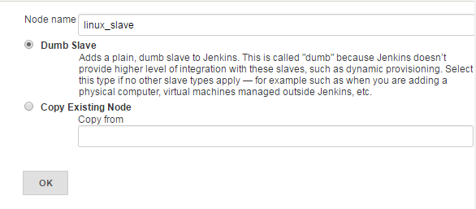
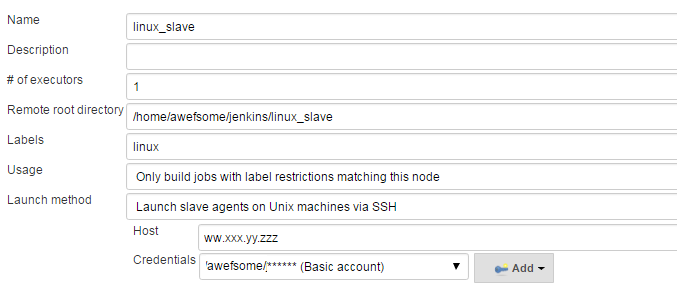
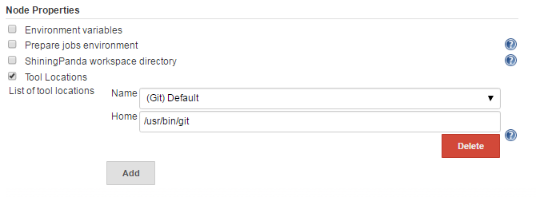

**Configure linux slave with windows master**

Prepare Jenkins linux machine to add it as slave by installing following programs:

    sudo apt-get install default-jre

Also check if ssh is present on the linux machine.  If not, please install ssh so that windows master would be able
to connect with slave using ssh:

    sudo apt-get openssh-server

---

## Add a new node

Jenkins >> nodes >> New Node

---

## Configure new Node

Configure new node with the following details:

Please make sure that in "Launch Method", you select "Launch slave agents on unix machines via SSH".

Also, insert hostname or ip of the slave machine in "Host" and ssh login credentials of a user on slave machine which
master will use to establish connection with slave.

---

## Configure slave tools

If you would like to use any tool on your linux slave, you can configure it as follows while you configure slave node:

as you can see in the above example, git is pointing to linux git binary, installed on linux slave. Since master is
windows, if we don't configure this, jenkins will try to use git.exe (from windows master) on linux slave.

Last but not the least, add public key of the master user (windows) in ~/.ssh/authorized_keys at linux slave machine.
So that jenkins master user should be able to connect to the linux slave . You can get the public key easily if you
have private key of master jenkins as follows:

    ssh-keygen -y -f ~/.ssh/id_rsa > ~/.ssh/id_rsa.pub

-y option outputs the public key.

That's all!!